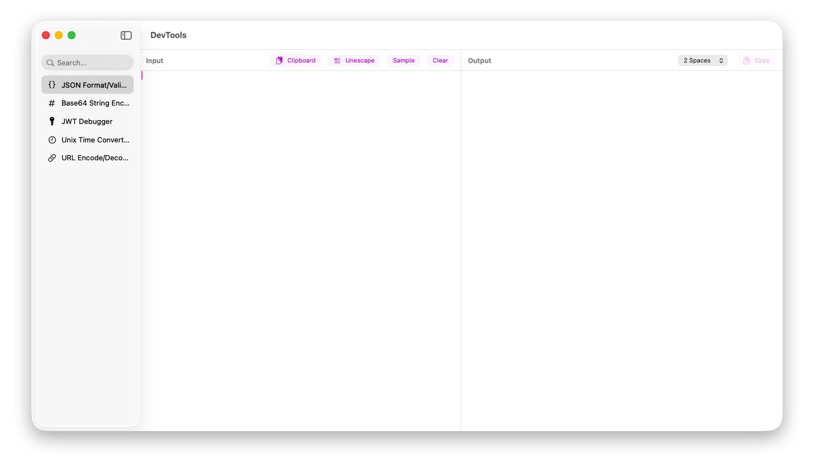

# DevTools

A native macOS developer tool application built with Swift and SwiftUI. Designed to be a lightweight, high-performance alternative to Electron-based toolkits.



## Features

### 🕒 Unix Time Converter
- Bidirectional conversion between Timestamp and ISO 8601 Date.
- **Smart Units**: Support for Seconds (s) and Milliseconds (ms) with auto-calculation.
- **Formats**: One-click copy for ISO 8601 (UTC/Local), RFC 2822, and Human-readable formats.

### 📋 JSON Formatter
- Validate and Pretty-print JSON.
- **Unescape**: One-click removal of escape characters (e.g., from logs).
- Indentation control (2 spaces / 4 spaces).

### 🔒 JWT Debugger
- Decode and visualize JWT Header, Payload, and Signature.
- Color-coded parts for easy reading.
- Large payload view area for complex tokens.

### 🔡 Encoders & Decoders
- **Base64**: Encode and Decode text.
- **URL**: Encode and Decode URLs.
- **Hash Generator**: MD5, SHA-1, SHA-256, SHA-512 (Hex & Base64 output).

### 📊 Visualization
- **Mermaid Preview**: Real-time rendering of Mermaid.js diagrams (Flowchart, Sequence, etc.) with automatic dark mode.

### ⚙️ Customization & Productivity
- **Sidebar Configuration**: Reorder or hide tools via `Settings` (Cmd+,).
- **Global Hotkeys**: Bind custom shortcuts to instantly open specific tools.
- **Floating Windows**: Hotkeys open a lightweight, always-on-top floating window for quick access without context switching.
- **Auto-Paste**: Automatically read clipboard content when opening tools via hotkey.
- **Menu Bar App**: Quick access from the system menu bar.

## Tech Stack

- **Language**: Swift 5.9+
- **UI Framework**: SwiftUI (macOS Native)
- **Architecture**: MVVM
- **State Management**: Combine
- **Build System**: Swift Package Manager (SPM) - No `.xcodeproj` needed!
- **Distribution**: Universal Binary (Intel & Apple Silicon).

## Getting Started

### Prerequisites

- macOS 14.0+
- Xcode 15.0+ (Command Line Tools required)

### Building the App

This project uses a pure SPM executable structure. We provide a script to bundle it into a proper macOS `.app` (Universal Binary).

```bash
# Build and generate DevTools.app
./scripts/build_app.sh
```

The output application will be located at `./DevTools.app`.

## Project Structure

```
.
├── Package.swift           # SPM Definition
├── scripts/
│   └── build_app.sh       # App bundling script
└── Sources/
    ├── App/               # Entry point (DevToolsApp.swift)
    ├── Models/            # Data models
    ├── Services/          # Pure logic (JSONService, UnixTimeService...)
    ├── ViewModels/        # Logic & State (Combine pipelines)
    └── Views/             # SwiftUI Views
```

## License

MIT
